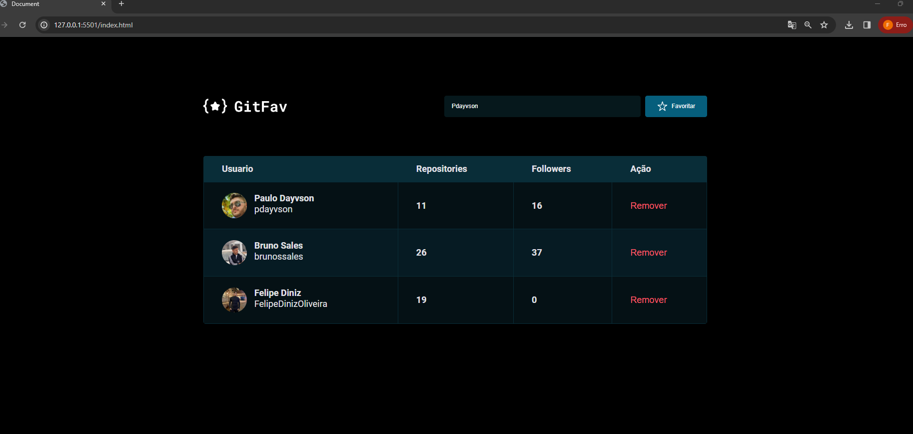

# GitHub Favorites Project in JavaScript:
I crafted an application to manage my GitHub favorites using JavaScript. Leveraging the GitHub API, I fetched and displayed user data. Favorites are stored locally using localStorage. Challenge completed successfully! 💻🌟 #JavaScript #CSS #APIGitHub #FIGMA

